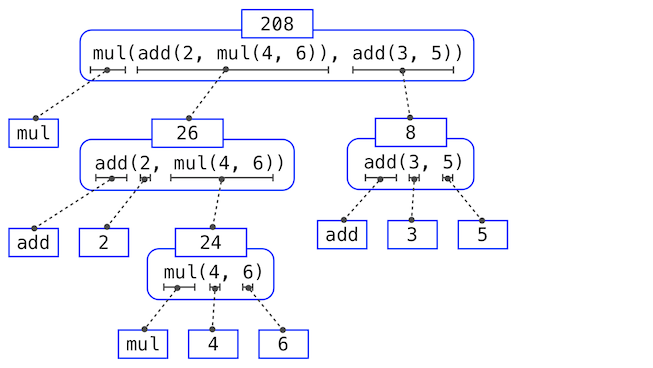

# Notes of CS61A: Structure and Interpretation of Computer Programs

+ Carolt
+ 2022.12.8 -

[TOC]

## Chapter 1: Building Abstraction with Functions

### 1.1 Getting started

The high productivity of computer science is only possible because the discipline is built upon an elegant and powerful set of fundamental ideas. All computing begins with **representing information**, specifying **logic** to proces it, and designing **abstractions** that manage the complexity of that logic. Mastering these fundamentals will require us to understand precisely **how computers interpret computer programs and carry out computational processes**.

> This fundamental ideas have long been taught using the classic textbook *Structure and Interpretation of Computer Programs* ([SICP](http://mitpress.mit.edu/sicp)).

+++

Python excels as an instructional languafe because, throughout its history, Python's developers have emphasized the human interpretability of Python code, reinforced by the [Zen of Python](http://www.python.org/dev/peps/pep-0020/) guiding priciples of beauty, simplicity, and readability.

> A language isn't something you learn so much as something you join.
>
> ​                                                                                                                                                     —[Arika Okrent](http://arikaokrent.com/)

### 1.2 Elements of programming

The [Python 3 Library Docs](http://docs.python.org/py3k/library/index.html) list the functions defined by each module. This documentation is written for developers who know the whole language well.

+++

In Python, if a value has been given a name, we say that the name **binds** to the value. Names can also be bound to functions or other objects. When executing an assignment statement, Python evaluates all the expression to the right of `=` **before** changing the binding to any name on the left.

+++

In evaluating nested call expressions, the interpreter is itself following a procedure. The evaluation procedure to a call expression is **recursive** in nature:

+ **Evaluate** the operator and operand subexpressions, then
+ **Apply** the function that is the value of the operator subexpression **to** the arguments that are the values of the operand subexpressions.

> This part of evaluating a call expression reminds me of the *post-order tranverse of binaty tree* and *postfix expression*. And the illustration is called exactly an ***expression tree***.
>
> 
>
> Viewing evaluation in terms of this tree, we can imagine that the values of the operand percolate upward, starting from the terminal nodes and then combining at higher levels.
>
> We take care of the primitive expressions such as numerals and names by stipulating that:
>
> + A numeral evaluates to the number it names.
>
> + A name evaluates to the value associated with that name in the current environment.
>
>   > **Environment** is the alies of memory that keeps track of the names, values, and binding.

However, the above evaluation procedure doesn't suffice to evaluate all Python code. In general, **statements** like `x = 4` are not evaluated but executed. Each type of expression or statement has its own evaluation or execution procedure.

++++

Pure functions: functions have some input(their arguments) and return some output(the result of applying them).

Non-pure functions: In addition to returning a value, applying a non-pure function can generate *side effects*, which make some change to the state of the interpreter or computer. For example, `print`.

### 1.3 Defining new functions

Function is an abstraction: binds name to expression.

```python
def <name>(<formal parameter>)
    return <return expression>
```

The body of function won't be executed until the function is called.

++++

The procedure of calling/applying a function:

+ creating a signature, adding a local frame which forms a new environment

  > `<name><formal parameter>` is called signature.

+ binding parameters(names) to arguments(values) in that frame

+ applying the function to the argument in that new environment

++++

Important things:

+ An environment is a sequence of frames.

  > A frame is consist of bindings between names and values.
  >
  > An environment is a sequence of frames.

+ A name evaluates to the value bound to that name in the earlist frame of the current envirenment in which that name is found.

+++

An environment keeps track of bindings between names and values.

Within a frame, a name can never be repeated, and it has to be bound to at most one value.

Assignment statements change bindings between names and values in frame.

### 1.4 Designing functions   

+ A function's domain is the set of all inputs it might possibly take as arguments.
+ A function's range is the set of  all outputs it might possibly return.
+ A pure function's behavior is the relationship it creates between inputs and outputs.

Domain and range are concepts and should be documented in the annotation.

++++

A guide to designing function:

+ Give each function exactly one job.
+ Don't repeat yourself(DRY). Implement a wheel only once, but execute it many times.
+ Define function generally.

++++

Some suggestions to implementing functions:

+ Always documents the domain(inputs), range(outputs), and behavior of a fuction.

+ Always comments.

+ Use default argument values.

  > As a guideline, most data value used in a function's body should be expressed as default values to named arguments.

```python
>>> def pressure(v, t, n):
        """Compute the pressure in pascals of an ideal gas.

        Applies the ideal gas law: http://en.wikipedia.org/wiki/Ideal_gas_law

        v -- volume of gas, in cubic meters
        t -- absolute temperature in degrees kelvin
        n -- particles of gas
        """
        k = 1.38e-23  # Boltzmann's constant
        return n * k * t / v
```

### 1.5 Control

Test. Here is to be implemented after exercises.

### 1.6 Higher-order functions

Functions are first-class: Functions can be manipulated as values in Python.

Higher-order function: A function that takes a function as an argument value or returns a function as a return value.

+++++

Functions as arguments:

```python
"""
Calculates the golden ratio.
"""
def improve(update, close, guess=1):
    while not close(guess):
        guess = update(guess)
    return guess

def golden_update(guess):
    return 1/guess + 1

def square_close_to_successor(guess):
    return approx_eq(guess * guess, guess + 1)

def approx_eq(x, y, tolerance=1e-3):
    return abs(x - y) < tolerance

phi = improve(golden_update, square_close_to_successor)
```

+++++

The above implementation causes global frame cluttered with names of small unique functions, each of which has a paticular function signature(constraints on number of parameter), making it less general.

Considering *nested definition* to address these two questions:

```python
"""
Nested definition implementation of calculation of golden ratio.
"""
def improve(guess=1):
    def update(guess):
        return 1/guess + 1
    def close(guess):
        return approx_eq(guess * guess, guess + 1)
    while not close(guess):
        guess = update(guess)
    return guess

def approx_eq(x, y, tolerance=1e-3):
    return abs(x - y) < tolerance

phi = improve()
```

Or we can use *lambda*:

```python
"""
Lambda implementation of calculation of golden ratio.
We can understand the structure of a lambda expression by constructing a corresponding English sentence:
	lambda			  x			   :		  f(g(x))
"A function that	takes x		and returns		f(g(x))"
"""
def improve(update, close, guess=1):
    while not close(guess):
        guess = update(guess)
    return guess

def approx_eq(x, y, tolerance=1e-3):
    return abs(x - y) < tolerance

phi = improve(lambda x : 1 / x + 1,
              lambda x : approx_eq(x * x, x + 1))
```

+++++

*Functions as return values*:

```python
def square(x):
    return x * x

def successor(x):
    return x + 1

def composel(f, g):
    def h(x):
        return f(g(x))
    return h
square_successor = composel(square, successor)
result = square_successor(12)
# result = composel(square, successor)(12)	# This statement has the same effect.
```

++++++

An exercise on Newton's method:

````python
def approx_eq(x, y):
    return abs(x - y) < 1e-10

def newton_method(f, df):
    def update(x):
        return x - f(x) / df(x)
    def close(x):
        return approx_eq(f(x), 0)
    geuss = 1
    while not close(guess):
        guess = update(guess)
    return guess

root_of_cube = newton_method(lambda x : x * x * x - 27,
                             lambda x : 3 * x * x)
````

++++

Currying: Transforming a multi-argument function into a single-argument, higher-order function.

````python
"""
Examples of currying.
"""
def curry2(f):
    def g(x):
        def h(y):
            return f(x, y)
        return h
    return g

# Equivalence of representation of lambda
curry2 = lambda f : lambda x : lambda y : f(x, y)

# Some usages of curry2
m = curry2(add)
add_three = m(3)
assert add_three(2) == 5, "add(3, 2) returns 5"
assert m(5)(201) == 206, "add(5, 201) returns 206"
assert curry2(add)(1)(2) == 3, "add(1, 2) returns 3"
````

Note: my python3.10 can sucessfully run above codes, while they fail at Python Tutor Online, due to the version probably.

++++

Lambda expressions are expressions that evaluate to a function.

`lambda x : x * x` means "A funtion with a parameter x that returns the value of x * x".

Note: **lambda expressions in Python cannot contain statements at all**. So do not try to use `while` or `if` in a lambda expression.

The difference between

```python
square = lambda x : x * x
```

and 

```python
def square(x):
    return x * x
```

is that the former creates the function with no name at all and the assignment statement binds the function value to the name square, wheras the latter creates the square function and binds it to the name of square, and all these happen automatically and are the byproduct of executing the def statement. In a word, only def statement gives a function intrinsic name.

+++

*Decorator* is a special syntax to apply higher-order functions as part of executing a `def` statement. 

Here is an examplel:

```python
# The trace() is a function that takes a function as argument
def trace(fn):
    def wrapped(x):
        print("Call" fn "on argument" x)
        return fn(x)
    return wrapped

# Below two piece of codes have the same effect
# Use @trace
@trace
def triple(x):
    return 3 * x
# don't use @trace
def triple(x):
    return 3 * x
triple = trace(triple)
```

### 1.7 Recursive functions

Exercise: inverse cascade

```python
"""
Prints an inverse cascade.
"""
def inverse_cascade(n):
    grow(n)
    print(n)
    shrink(n)
def f_then_g(f, g, n):
    if n:
        f(n)
        g(n)
grow = lambda n : f_then_g(grow, print, n // 10)
shrink = lambda n : f_then_g(print, shrink, n // 10)
inverse_cascade(1234)
```


## Chapter 2: Building Abstractions with Data


## Chapter 3: Interpreting Computer Programs


## Chapter 4: Data Processing


