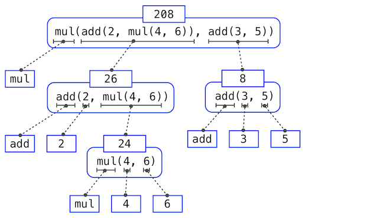

# Notes of CS61A: Structure and Interpretation of Computer Programs

+ Carolt
+ 2022.12.8 -
+ [TEXT](http://composingprograms.com/)

[TOC]

## Chapter 1: Building Abstraction with Functions

### 1.1 Getting started

The high productivity of computer science is only possible because the discipline is built upon an elegant and powerful set of fundamental ideas. All computing begins with **representing information**, specifying **logic** to process it, and designing **abstractions** that manage the complexity of that logic. Mastering these fundamentals will require us to understand precisely **how computers interpret computer programs and carry out computational processes**.

> This fundamental ideas have long been taught using the classic textbook *Structure and Interpretation of Computer Programs* ([SICP](http://mitpress.mit.edu/sicp)).

+++

Python excels as an instructional language because, throughout its history, Python's developers have emphasized the human interpret-ability of Python code, reinforced by the [Zen of Python](http://www.python.org/dev/peps/pep-0020/) guiding principles of beauty, simplicity, and readability.

> A language isn't something you learn so much as something you join.
>
> ​                                                                                                                                                     —[Arika Okrent](http://arikaokrent.com/)

### 1.2 Elements of programming

The [Python 3 Library Docs](http://docs.python.org/py3k/library/index.html) list the functions defined by each module. This documentation is written for developers who know the whole language well.

+++

In Python, if a value has been given a name, we say that the name **binds** to the value. Names can also be bound to functions or other objects.

When executing an assignment statement, Python

+ First evaluate all expressions right of =, **from left to right**;
+ Then bind the names on the left to the resulting values in the **current frame**.

+++

In evaluating nested call expressions, the interpreter is itself following a procedure. The evaluation procedure to a call expression is **recursive** in nature:

+ **Evaluate** the operator and operand subexpressions, then
+ **Apply** the function that is the value of the operator subexpression **to** the arguments that are the values of the operand subexpressions.

> This part of evaluating a call expression reminds me of the *post-order traverse of binary tree* and *postfix expression*. And the illustration is called exactly an ***expression tree***.
>
> 
>
> Viewing evaluation in terms of this tree, we can imagine that the values of the operand percolate upward, starting from the terminal nodes and then combining at higher levels.
>
> We take care of the primitive expressions such as numerals and names by stipulating that:
>
> + A numeral evaluates to the number it names.
>
> + A name evaluates to the value associated with that name in the current environment.
>
>   > **Environment** is the allies of memory that keeps track of the names, values, and binding.
>
> **NOTE: The order is very important!** The execution order of the expression is similar to C comma expression, which is executed from left to right.

However, the above evaluation procedure doesn't suffice to evaluate all Python code. In general, **statements** like `x = 4` are not evaluated but executed. Each type of expression or statement has its own evaluation or execution procedure.

++++

Pure functions: functions have some input(their arguments) and return some output(the result of applying them).

Non-pure functions: In addition to returning a value, applying a non-pure function can generate *side effects*, which make some change to the state of the interpreter or computer. For example, `print`.

### 1.3 Defining new functions

Function is an abstraction: binds name to expression.

```python
def <name>(<formal parameter>)
    return <return expression>
```

The body of function won't be executed until the function is called.

++++

The procedure of calling/applying a function:

+ creating a signature, adding a local frame which forms a new environment

  > `<name><formal parameter>` is called signature.

+ binding parameters(names) to arguments(values) in that frame

+ applying the function to the argument in that new environment

++++

Important things:

+ An environment is a sequence of frames.

  > A frame is consist of bindings between names and values.
  >
  > An environment is a sequence of frames.

+ A name evaluates to the value bound to that name in the earlist frame of the current envirenment in which that name is found.

+++

An environment keeps track of bindings between names and values.

Within a frame, a name can never be repeated, and it has to be bound to at most one value.

Assignment statements change bindings between names and values in frame.

### 1.4 Designing functions   

+ A function's domain is the set of all inputs it might possibly take as arguments.
+ A function's range is the set of  all outputs it might possibly return.
+ A pure function's behavior is the relationship it creates between inputs and outputs.

Domain and range are concepts and should be documented in the annotation.

++++

A guide to designing function:

+ Give each function exactly one job.
+ Don't repeat yourself(DRY). Implement a wheel only once, but execute it many times.
+ Define function generally.

++++

Some suggestions to implementing functions:

+ Always documents the domain(inputs), range(outputs), and behavior of a fuction.

+ Always comments.

+ Use default argument values.

  > As a guideline, most data value used in a function's body should be expressed as default values to named arguments.

```python
>>> def pressure(v, t, n):
        """Compute the pressure in pascals of an ideal gas.

        Applies the ideal gas law: http://en.wikipedia.org/wiki/Ideal_gas_law

        v -- volume of gas, in cubic meters
        t -- absolute temperature in degrees kelvin
        n -- particles of gas
        """
        k = 1.38e-23  # Boltzmann's constant
        return n * k * t / v
```

### 1.5 Control

Maybe some tips will help. 

Command `python3 -i file.py` allows you to run a Python script interactively. Command `python3 -m doctest` is helpful when you want to run all the unit test in a script. An example of these unit tests is following:

````python
def always_true(x):
    """No matter what input argument is, the return value is true.
    
    >>> 1
    True
    >>> 0
    True
    >>> None
    True
    >>> False
    True
    """
    return True
````

### 1.6 Higher-order functions

Functions are first-class: Functions can be manipulated as values in Python.

Higher-order function: A function that takes a function as an argument value or returns a function as a return value.

+++++

Functions as arguments:

```python
"""
Calculates the golden ratio.
"""
def improve(update, close, guess=1):
    while not close(guess):
        guess = update(guess)
    return guess

def golden_update(guess):
    return 1/guess + 1

def square_close_to_successor(guess):
    return approx_eq(guess * guess, guess + 1)

def approx_eq(x, y, tolerance=1e-3):
    return abs(x - y) < tolerance

phi = improve(golden_update, square_close_to_successor)
```

+++++

The above implementation causes global frame cluttered with names of small unique functions, each of which has a particular function signature(constraints on number of parameter), making it less general.

Considering *nested definition* to address these two questions:

```python
"""
Nested definition implementation of calculation of golden ratio.
"""
def improve(guess=1):
    def update(guess):
        return 1/guess + 1
    def close(guess):
        return approx_eq(guess * guess, guess + 1)
    while not close(guess):
        guess = update(guess)
    return guess

def approx_eq(x, y, tolerance=1e-3):
    return abs(x - y) < tolerance

phi = improve()
```

Or we can use *lambda*:

```python
"""
Lambda implementation of calculation of golden ratio.
We can understand the structure of a lambda expression by constructing a corresponding English sentence:
	lambda			  x			   	:		    f(g(x))
"A function that	takes x		and returns		f(g(x))"
"""
def improve(update, close, guess=1):
    while not close(guess):
        guess = update(guess)
    return guess

def approx_eq(x, y, tolerance=1e-3):
    return abs(x - y) < tolerance

phi = improve(lambda x : 1 / x + 1,
              lambda x : approx_eq(x * x, x + 1))
```

+++++

*Functions as return values*:

```python
def square(x):
    return x * x

def successor(x):
    return x + 1

def composel(f, g):
    def h(x):
        return f(g(x))
    return h
square_successor = composel(square, successor)
result = square_successor(12)
# result = composel(square, successor)(12)	# This statement has the same effect.
```

++++++

An exercise on Newton's method:

````python
def approx_eq(x, y):
    return abs(x - y) < 1e-10

def newton_method(f, df):
    def update(x):
        return x - f(x) / df(x)
    def close(x):
        return approx_eq(f(x), 0)
    geuss = 1
    while not close(guess):
        guess = update(guess)
    return guess

root_of_cube = newton_method(lambda x : x * x * x - 27,
                             lambda x : 3 * x * x)
````

++++

Currying: Transforming a multi-argument function into a single-argument, higher-order function.

````python
"""
Examples of currying.
"""
def curry2(f):
    def g(x):
        def h(y):
            return f(x, y)
        return h
    return g

# Equivalence of representation of lambda
curry2 = lambda f : lambda x : lambda y : f(x, y)

# Some usages of curry2
m = curry2(add)
add_three = m(3)
assert add_three(2) == 5, "add(3, 2) returns 5"
assert m(5)(201) == 206, "add(5, 201) returns 206"
assert curry2(add)(1)(2) == 3, "add(1, 2) returns 3"
````

Note: my python 3.10 can successfully run above codes, while they fail at Python Tutor Online, due to the version probably.

++++

Lambda expressions are expressions that evaluate to a function.

`lambda x : x * x` means "A funtion with a parameter x that returns the value of x * x".

Note: **lambda expressions in Python cannot contain statements at all**. So do not try to use `while` or `if` in a lambda expression.

The difference between

```python
square = lambda x : x * x
```

and 

```python
def square(x):
    return x * x
```

is that the former creates the function with no name at all and the assignment statement binds the function value to the name square, whereas the latter creates the square function and binds it to the name of square, and all these happen automatically and are the byproduct of executing the def statement. In a word, only def statement gives a function intrinsic name.

+++

*Decorator* is a special syntax to apply higher-order functions as part of executing a `def` statement. 

Here is an example:

```python
# The trace() is a function that takes a function as argument
def trace(fn):
    def wrapped(x):
        print("Call" fn "on argument" x)
        return fn(x)
    return wrapped

# Below two piece of codes have the same effect
# Use @trace
@trace
def triple(x):
    return 3 * x
# don't use @trace
def triple(x):
    return 3 * x
triple = trace(triple)
```

+++++

There is a very interesting application of higher-order function in the project 1 Hog. The specific part is Phase 2: Commentary. See [the demo of this part of task](https://inst.eecs.berkeley.edu/~cs61a/su20/proj/hog/#phase-2-commentary).

> In the second phase, you will implement commentary functions that print remarks about the game after each turn, such as, `"22 points! That's the biggest gain yet for Player 1."`
>
> A commentary function takes two arguments, Player 0's current score and Player 1's current score. It can print out commentary based on either or both current scores and any other information in its parent environment. Since commentary can **differ from turn** to turn depending on the current point situation in the game, a commentary function always **returns another commentary function to be called on the next turn**. The only side effect of a commentary function should be to print.

### 1.7 Recursive functions

Exercise: inverse cascade

```python
"""
Prints an inverse cascade.
"""
def inverse_cascade(n):
    grow(n)
    print(n)
    shrink(n)
def f_then_g(f, g, n):
    if n:
        f(n)
        g(n)
grow = lambda n : f_then_g(grow, print, n // 10)
shrink = lambda n : f_then_g(print, shrink, n // 10)
inverse_cascade(1234)
```


## Chapter 2: Building Abstractions with Data

### 2.2 Data abstraction

Abstraction barriers shape the way in which we think about data. Take rational number as an example, a valid representation of a rational number is not restricted to any particular implementation(such as a two-element list); it is a value returned by `rational` that can be passed to `numer`, and `denom`. In addition, the appropriate relationship must hold the constructor and selectors. That is, if we construct a rational number `x` from integers `n` and `d`, then it should be the case that `numer(x)/denom(x)` is equal to `n/d`.

For example, the following is the implementation of `pair` and its `selector` via the use of higher-order functions.

````python
def pair(x, y):
    """Return a function that represents a pair."""
    def get(index):
        if index == 0:
            return x
        elif index == 1:
            return y
        return get
    
def select(p, i):
    """Return the element at index i of pair p."""
    return p(i)
````

### 2.3 Sequences

Here is a convention used when argument `_` isn't used in loop suite:

```python
for _ in range(n):
    print("hello")
```

+++++

The general form of a list comprehension:

```python
[map_expression for name in sequence_expression if filter_expression]
```

+++

The common patterns in sequence processing can be expressed using higher-order functions.

```python
def apply_to_all(map_fn, s):
    return [map_fn(x) for x in s]
def keep_if(filter_fn, s):
    return [x for x in s if filter_fn(x)]
def reduce(reduce_fn, s, initial=1):
    reduced = initial
    for x in s:
        reduced = reduce_fn(reduced, x)
    return reduced
```

The conventional names of `apply_to_all`, `keep_if`, and `reduce` are `map`, `filter`, and `reduce`. However, in Python the built-in `map` and `filter` are generalizations of these functions that do not return lists, so the definitions above are equivalent to applying list constructor to the result of those built-in functions:

```python
apply_to_all = lambda map_fn, s: list(map(map_fn, s))
keep_if = lambda filter_fn, s: list(filter(filter_fn, s))
```

The `reduce` function is built into the `functools` module of Python standard library and the `initial` parameter is optional.

+++++

Common operations and results of list

```python
s = [2, 3]
t = [5, 6]
```

|                          Operation                           |                        Example                        |                           Results                            |
| :----------------------------------------------------------: | :---------------------------------------------------: | :----------------------------------------------------------: |
|          **append**:<br> adds one element to a list          |                 s.append(t)<br>t = 0                  |  |
| **extend**:<br> adds all elements in one list to another list |               s.extend(t)<br/>t[1] = 0                |  |
| addition & slicing:<br>create new lists **containing existing elements** | a = s + [t]<br>b = a[1:]<br>a[1] = 9<br>b\[1]\[1] = 0 |  |
| The list function:<br> creates a new list which contains new elements |                t = list(s)<br>s[1] = 0                |  |
|    slice assignment:<br>replaces a slice with new values     |          s[0:0] = t<br>s[3:] = t<br>t[1] = 0          |  |
|                       complex example                        |     t = [1, 2, 3]<br>t[1:3] = [t]<br>t.extend(t)      |  |

++++

Box-and-pointer notation in environment diagram: 

Lists are represented as a row of index-labeled adjacent boxes, one per element. Each box either contains a primitive value or points to a compound value. This can be used to represent a hierarchical structures.

+++++

Some tips while using list:

+ Use list comprehension `[]` instead of `list()`. `[expression]` will generate a list for even the expression is a single number, while `list(iterable)` ask for an exact iterable parameter.
+ No reference in `for` loop iteration. Unlike `for &i in container` in C++, you can not consider the `i` in `for i in sequence:` as a reference or iterator to elements of `sequence`, instead you are only allowed to treat `i` as a copy to a particular element in the `sequence`.

### 2.4 Mutable data

Objects are important concepts in software engineering. An object is a value that behaves like what it supposed to represent.

+ Objects represent information.
+ They consist of data and behavior, bundled together to create abstractions.
+ Objects can represent things, but also properties, interactions, and processes. Anything that has attributes can be represent as objects.
+ A type of object is called a class; classes are first-class values in Python. They can be passed in as arguments to function.
+ Object-oriented programming
  + An approach for organizing large programs.
  + Special syntax that can improve the composition of programs.
+ In Python, every value is an object
  + All objects have attributes.
  + A lot of data manipulation happens through object methods.
  + Functions do one thing; objects do many related things.

+++++

Sameness and change:
$$
same \neq equal\\
Identity \neq Equality
$$

+ Identity:

  ```python
  <exp0> is <exp1>
  ```

  evaluates to True if both <exp0> and <exp1> evaluate to the same object.

+ Equality:

  ```python
  <exp0> == <exp1>
  ```

  evaluates to True if both <exp0> and <exp1> evaluate to equal values.

  > + A compound data object has an "identity" in addition to the pieces of which it is composed. A list is still "the same" list even if its contents is changed.
  > + Conversely, two different list may happen to have "equal" contents.

Some dangerous mutation examples:

+ Mutation can happen within a function call, since a function can change the value of any object in its scope or global scope.

  > ```python
  > four = [1, 2, 3, 4]
  > def mystery(s):
  >     s.pop()
  > mystery(four)
  > ```
  >
  > The length of `four` is changed to 3.

+ A mutable default argument. A default argument is part of a function value, not generated by a call.

  > ```python
  > def f(s=[]):
  >     s.append(5)
  > ```
  >
  > If you call `f` 3 times and the length of list `s` will be 3.

Ways to change an immutable object:

+ The value of an expression can change because of changes in names or objects.
+ An immutable sequence may still change if it *contains* a mutable value as an element.

+++++

Dictionaries.

+ A key of a dictionary cannot **be or contain** a mutable value.
+ The dictionary type supports various methods of iterating over the contents of the dictionary as a whole, such as `keys`, `values`, and `items`.
+ In Python 3.6+, the order of items in a dictionary is the order in which they were added, while items appeared in an varbitrary order for the Python 3.5 or an earlier version.

+++++

The `nonlocal` statement.

+ **The `nonlocal` statement** declares that whenever we change the binding of the name of a variable, the binding is changed in **the first frame** in which the name of this variable is **already bound**.

  Without the `nonlocal` statement, **an assignment statement** would always bind a name in **the first frame** of the current environment.

+ The effect of a `nonlocal` statement in Python: a name(and its binding) **outside of the first local frame** can be changed by an **assignment statement**.

  And note that **no** `nonlocal` statement is required to **access a non-local name**; a locally defined function can look up names outside of its local frame.

Python particulars.

+ This pattern of non-local assignment is a general feature of programming languages with higher-order functions and lexical scope.

  Most other languages do not require a `nonlocal` statement at all. Instead, non-local statement is often the default behavior of assignment statements.

  > I can't agree this more as a begin-learner of Python who only writes C/C++ codes before.

+ Another unusual restriction regarding the lookup of names in Python is: **within the body of a function, all instances of a name must refer to the same frame**.

  As a result, Python cannot look up the value of a name in a non-local frame, then bind that same name in the local frame, because the same name would be accessed in two different frames in the same function.

  This restriction allows Python to pre-compute which frame contains each name before executing the body of a function. And violating this restriction will cause **a confusing error message**: `UnboundLocalError: local variable <varname> referenced before assignment`.

  > Take `x = 2` as an example to explain **all status and corresponding effects** of assignment statements:
  >
  > |                            Status                            |                            Effect                            |
  > | :----------------------------------------------------------: | :----------------------------------------------------------: |
  > |  No `nonlocal` statement, and "x" **is not** bound locally.  | Create a new binding from name "x" to object 2 in the first frame of the current environment. |
  > |    No `nonlocal` statement, and "x" **is** bound locally.    | Re-bind name "x" to object 2 in the first frame of the current environment. |
  > |   `nonlocal` x, and "x" **is** bound in a non-local frame.   | Re-bind "x" to 2 in the first non-local frame of the current environment in which it is bound. |
  > |   `nonlocal` x, "x" **is not** bound in a non-local frame.   |       SyntaxError: no binding for nonlocal 'x' found.        |
  > | `nonlocal` x, "x" **is** bound in a non-local frame and "x" also bound locally. |       SyntaxError: name 'x' is parameter and nonlocal.       |

++++

Advanced topic of mutable data:

+ The benefits and cost of non-local assignment.
+ Implementing lists and dictionaries.
+ Dispatch dictionaries.
+ Propagating constraints.

### 2.5 Object-oriented programming

Class is the template of all its object.

```python
class <name>:
    <suite>
```

A class statement creates a new class and binds that class to <name> in the first frame of the current environment. The <suite> is executed when the class statement is executed.

+++++

Object construction:

```python
class <name>:
    def __init__(self, *args):
        <statements>
```

Object identity:

+ Every object that is an instance of a user-defined class has a unique identity.
+ Binding an object to a new name using assignment does not create a new object.

+++++

All invoked methods have access to the object via the `self` parameter, and so they can **all access and manipulate the object's state**.

Attributes are data stored within either an instance or a class itself. They can be accessed via a dot expression or a built-in function(`getattr()` or `hasattr()`).

Python distinguished between:

+ *Functions*, and
+ *Bound methods*, which couple together a function and the object on which that method will be invoked.

> $$
> Object + Function = Bound\ Method
> $$
>
> They have different types,
>
> ````python
> >>> type(Account.deposit)
> <class 'function'>
> >>> type(tom_account.deposit)
> <class 'method'>
> ````
>
> and different usages.
>
> ```python
> >>> Account.deposit(tom_account, 1001)
> 1011
> >>> tom_account.deposit(1000)
> 2011
> ```

To evaluate a dot expression ---- `<expression>.<name>`:

+ Evaluate the `<expression>` to the left of the dot, which yields the object of the dot expression.
+ `<name>` is matched against the instance attributes of that object; **if an attribute with that name exists**, its value is returned.
+ If not, `<name>` is looked up in the class, which yields a class attribute value.
+ That value is returned **unless it is a function**, in which case a *bound method* is returned instead.

Class attributes are "shared" across all instances of a class because they are attributes of the class, not the instance.

Assignment to attributes has the following rules:

+ If the object is an instance, then assignment sets an instance attribute.
+ If the object is a class, then assignment sets a class attribute.

+++++

Practice 1:

> 
>
> Draw the diagram:
>
> 
>
> Note:
>
> + `__repr__(self)` is what returned when an instance is called in an interactive session.
> + `jack.greeting = 'Maam'` is the attribute assignment which will not change the bind of class attribute, instead it adds a bind of a instance attribute immediately.
>
> The answer is:
>
> 
>
> Errata:
>
> ```python
> >>> jack
> "Peon"
> ```

Practice 2:

> 
>
> The diagram is:
>
> 
>
> The answer is:
>
> 

+++++

Inheritance is a method for relating classes together.

```python
class <name>(<base class>):
    <suite>
```

Conceptually, the new *subclass* "shares" attributes with its base class, while the subclass may *override* certain inherited attributes.

To look up a name in a class:

+ If it names an attribute in the class, return the attribute value.
+ Otherwise, look up the name in the base class, if there is one.

Designing for inheritance:

+ Don't repeat and use existing implementations.
+ Attributes that have been overridden are still accessible via class objects.(see above "to look up a name in class")
+ Look up attributes on instances whenever possible.

Multiple inheritance

````python
class Subclass(Class1, Class2, ...):
    def __init__(self, *args):
        <statements>
````

### 2.7 Object abstraction

String conversion:

+ `str()`: returns a human-readable string.

+ `repr()`: returns a Python expression that evaluates to an equal object.

  ```python
  repr(object) -> string
  ```

  Return the canonical string representation of the object. And for most object types, `eval(repr(object)) == object`.

+++++

Polymorphic function: A function that applies to many(poly) different forms(morph) of data, such as `str()` and `repr()`(and `bool()` in the following instance).

> Note that an instance attribute called `__repr__` is ignored, and **only class attribute** are found! So actual implementation of `repr()` is more likely to:
>
> ````python
> def repr(x):
>     return x.__repr__(x)
> ````
>
> Here are differences of `str()`, `repr()` and instance attribute `__str__()` and `__repr__()`:
>
> + NO instance attribute:
>
>   
>
> + WITH instance attribute:
>
>   

Special method names

+ They start and end with two underscores and have built-in behavior.

  > 

+ And the behavior of calling some built-in function equals to using the corresponding special methods:

  > 

  This enables Python to have a great extensibility to write more interfaces like `str()` and `repr()`.

+++++

Modular design:

*Separation of concerns* is a design principle: Isolate different parts of a program that address different concerns. When you build one part of the program, the part should have to know as little as possible about other concerns that aren't its concern.

Take Hog and Ants projects as examples:

> 

### 2.9 Recursive objects

Property methods:

+ `@property` decorator: 

  ````python
  class Link:
      ...
      @property
      def second(self):
          return self.rest.first
  ````

  then if `s` is a `Link` object, `s.second() == s.second` returns `True`.

+ `@<attribute>.setter` decorator:

  ````python
  class Link:
      ...
      @<attribute>.setter
      def second(self, value):
          self.rest.first = value
  ````

  then if `s` is a `Link` object, `s.second = 6` will bind the `s.rest.first` to 6.

+++++

Nothing more is interesting.

## Chapter 3: Interpreting Computer Programs


## Chapter 4: Data Processing

### 4.2 Implicit sequences

Iterators.

+ A container can provide an iterator that provides access to its elements in some order.

  + `iter(iterable)`: Return an iterator over the elements of an iterable value.
  + `next(iterator)`: Return the next element in an iterator.

+ An *iterable* value is any value that can be passed to `iter` to produce an iterator.

  An iterator can be passed to `iter`, so it's also iterable.

+ An *iterator* is returned from `iter` and can be passed to `next`; all iterators are mutable.

+++++

Built-in functions for iteration.

+ Many built-in Python sequence operations return **iterators** that compute results *lazily*.

  > Here "lazily" means that the result is only computed by the interpreter only when it is requested.

  The followings are some examples:

  + `map(func, iterable)`: Iterate over func(x) for x in iterable.
  + `filter(func, iterable)`: Iterate over x in iterable if func(x).
  + `zip(first_iter, second_iter)`: Iterate over co-indexed (x, y) pairs.
  + `reversed(sequence)`: Iterate over x in a sequence in a reverse order.

+ To view the contents of an iterator(it's iterable too!), place the resulting elements into a container. And to generate the container, all computation work will be done.

  Use `list(iterable)`, `tuple(iterable)`, `sorted(iterable)`(creates a sorted list containing x in iterable).

+++++

Generators.

+ A *generator function* is a function that **yield**s values instead of **return**ing them.
+ A normal function **return**s once; a *generator function* can **yield** multiple times.
+ A *generator* is an iterator created automatically by calling a *generator function*.
+ When a *generator function* is called, it returns a *generator* that iterates over its yields.

Generators & Iterators.

+ A `yield from` statement yields all values from an iterator or iterable.

  > To implement the following function:
  >
  > ```python
  > >>> list(a_then_b([3, 4], [5, 6]))
  > [3, 4, 5, 6]
  > ```
  >
  > we can use `yield` or `yield from` statement.
  >
  > ````python
  > # yield version
  > def a_then_b(a, b):
  >     for x in a:
  >         yield x
  >     for x in b:
  >         yield y
  > # yield from version
  > def a_then_b(a, b):
  >     yield from a
  >     yield from b
  > ````

+ And `yield from` can be used in recursion.

  > `````python
  > """
  > >>> list(countdown(5))
  > [5, 3, 2, 2, 1]
  > """
  > def countdown(k):
  >     if k > 0:
  >         yield k
  >         yield from countdown(k - 1)
  > `````
  >
  > Note that countdown is a generator function and creates a generator, so it is legal to `yield from` a generator created by `countdown`.


## Appendix

### A. Debugging

````
Traceback (most recent call last):
  File "<pyshell#29>", line 3 in <module>
    result = buggy(5)
  File <pyshell#29>", line 5 in buggy
    return f + x
TypeError: unsupported operand type(s) for +: 'function' and 'int'
````

The most recent function call of a *traceback* message is at the bottom.

The very last line in the traceback message is the error statement(`<error type>: <error message>`).

+++++

A trick to enable long-term debugging:

```python
debug = True

def foo(n):
i = 0
while i < n:
    i += func(i)
    if debug:
        print('DEBUG: i is', i)
```

++++

Exception is a built-in mechanism in a programming language to declare and respond to exceptional conditions. Python *raises* an exception whenever an error occurs. Exceptions can be *handled* by the program, preventing the interpreter from halting, while unhandled exceptions will cause Python to halt execution and print a stack trace.

Mastering exceptions:

+ Exceptions are objects.

+ Exceptions enable non-local continuations of control.

  > If `f` calls `g` and `g` calls `h`, exceptions can shift control from `h` to `f` without waiting for `g` to return.

+ Exceptions handling tends to be slow.

Raising exceptions:

+ Assert statement raise an exception of type AssertionError.

  ```python
  assert <expression>, <string>
  ```

  All assert statement can be ignored to increase efficiency by running Python with the "-O" flag or set a bool `__debug__` to `False`.

+ Raise statement raise an exception.

  ```python
  raise <expression>
  ```

  `<expression>` must evaluate to a subclass of BaseException or an instance of one. For example:

  ```python
  raise TypeError("Bad argument")
  ```

Handling exceptions ------ try statements:

+ Code sample:

  ```python
  try:
      <try suite>
  except <exception class> as <name>:
      <except suite>
  ```

  > For example, this is a function that returns the value of `n` continuously dividing all numbers in `ds`:
  >
  > ````python
  > def divide_all(n, ds):
  >     try:
  >         return reduce(truediv, ds, n)
  >     except ZeroDivisionError:
  >         return float('inf')
  > ````

+ Execution rules:

  The `try suite` is executed first.

  The `except suite` is executed with `<name>` bound to the exception if

  + during the course of executing the `try suite`, an exception is raised that is **not handled** otherwise,
  + and the class of the exception inherits from `exception class`.

  The exception handled in `except suite` **will not cause an exception raised**.

### B. Errata

[Q5 "Joint Account"](https://inst.eecs.berkeley.edu/~cs61a/su20/hw/hw05/#q5) from `hw05.py`:

> Suppose that our banking system requires the ability to make joint accounts.  Define a function `make_joint` that takes three arguments.
>
> 1. A password-protected `withdraw` function,
> 2. The password with which that `withdraw` function was defined, and
> 3. A new password that can also access the original account.
>
> If the password is incorrect or cannot be verified because the underlying account is locked, the `make_joint` should propagate the error. Otherwise, it returns a `withdraw` function that provides additional access to the original account using *either* the new or old password. Both functions draw from the same balance. Incorrect passwords provided to either function will be stored and cause the functions to be locked after three wrong attempts.
>
> *Hint*: The solution is short (less than 10 lines) and contains no string literals!  The key is to call `withdraw` with the right password and amount, then interpret the result.  You may assume that all failed attempts to withdraw will return some string (for incorrect passwords, locked accounts, or insufficient funds), while successful withdrawals will return a number.
>
> Use `type(value) == str` to test if some `value` is a string.

Note that the parameter `withdraw` in `make_joint(withdraw, old_pass, new_pass)` is the function returned by `make_joint` previously called. And if the `withdraw` function is defined in the `make_joint`, different `withdraw` functions may be in different frames.

+++++

[Q6 "Remainder Generator"](https://inst.eecs.berkeley.edu/~cs61a/su20/hw/hw05/#q6) from `hw05.py`:

> Like functions, generators can also be *higher-order*. For this problem, we will be writing `remainders_generator`, which yields a series of generator objects.
>
> `remainders_generator` takes in an integer `m`, and yields `m` different generators. The first generator is a generator of multiples of `m`, i.e. numbers where the remainder is 0. The second is a generator of natural numbers with remainder 1 when divided by `m`. The last generator yields natural numbers with remainder `m - 1` when divided by `m`.
>
> > *Hint*: You can call the `naturals` function to create a generator of infinite natural numbers.
>
> > *Hint*: Consider defining an inner generator function. Each yielded generator varies only in that the elements of each generator have a particular remainder when divided by `m`. What does that tell you about the argument(s) that the inner function should take in?
>
> Note that if you have implemented this correctly, each of the generators yielded by `remainder_generator` will be *infinite* - you can keep calling `next` on them forever without running into a `StopIteration` exception.

Note that a function containing a `yield from` statement is also a generator function. I used built-in `filter` and `map` function in this question, and each of them returns an iterable object.

+++++

[Q2 Generators generator](https://inst.eecs.berkeley.edu/~cs61a/su20/lab/lab08/#q2) from `lab08.py`:

> Write the generator function `make_generators_generator`, which takes a zero-argument generator function `g` and returns a generator that yields generators.  For each element `e` yielded by the generator object returned by calling `g`, a new generator object is yielded that will generate entries 1 through `e` yielded by the generator returned by `g`.

Note that this question is another "higher-order generator" problem.

+++++

[Q8 The Professor Arrives]("Tesla Model S goes vroom!") from `lab08.py`:

>A new challenger has appeared! Implement the `effect` method for the Professor, who adds the opponent card's attack and defense to all cards in the player's deck and then removes *all* cards in the opponent's deck that have the same attack or defense as the opponent's card.
>
>> *Note:* You might run into trouble when you mutate a list as you're iterating through it. Try iterating through a copy instead! You can use slicing to copy a list:
>>
>> ```
>>   >>> lst = [1, 2, 3, 4]
>>   >>> copy = lst[:]
>>   >>> copy
>>   [1, 2, 3, 4]
>>   >>> copy is lst
>>   False
>> ```

Another way to avoid iterate through a size-changing container(iterable) is this:

````python
cnt = 0
while cnt != len(container):
    if <condition to change size>:
        # change size of container
    else:
        cnt += 1
````

+++++

[Q6 Yield Paths](https://inst.eecs.berkeley.edu/~cs61a/su20/hw/hw06/#q6) from`hw06.py`:

> Define a generator function `path_yielder` which takes in a Tree `t`, a value `value`, and returns a generator object which yields each path from the root of `t` to a node that has label `value`.
>
> `t` is implemented with a class, not as the function-based ADT.
>
> Each path should be represented as a list of the labels along that path in the tree. You may yield the paths in any order.
>
> We have provided a (partial) skeleton for you. You do not need to use this skeleton, but if your implementation diverges significantly from it, you might want to think about how you can get it to fit the skeleton.

The implementation below will cause an GeneratorExit exception when nested (generator)function `dfs` is called:

````python
def path_yielder(t, value):
    "*** YOUR CODE HERE ***"
    paths = []
    def dfs(t, path):
        path.append(t.label)
        if t.label == value:
            lst = path[:]
            yield lst # This line makes dfs a generator function
            #paths.append(path[:])
        for b in t.branches:
            dfs(b, path)
        path.pop()
    dfs(t, [])
    #yield from paths
````

One of the correct version is to delete the `yield lst` line, and then add the comment lines.

And here is [a more elegant implementation](https://github.com/PKUFlyingPig/CS61A/blob/master/hws/hw06/hw06.py):

```python
def path_yielder(t, value):
    "*** YOUR CODE HERE ***"
    if t.label == value:
        yield [value]
    for b in branches:
        for path in path_yielder(b, value):
            yield [t.label] + path
```

